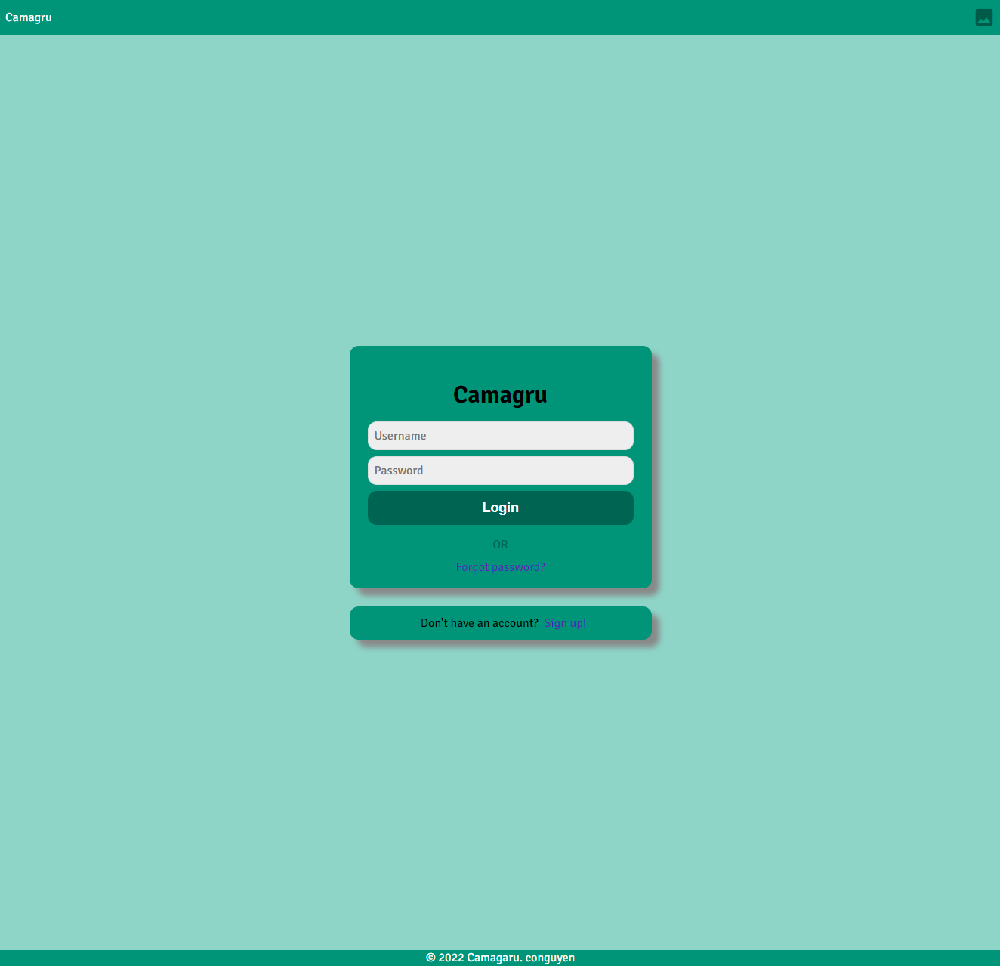
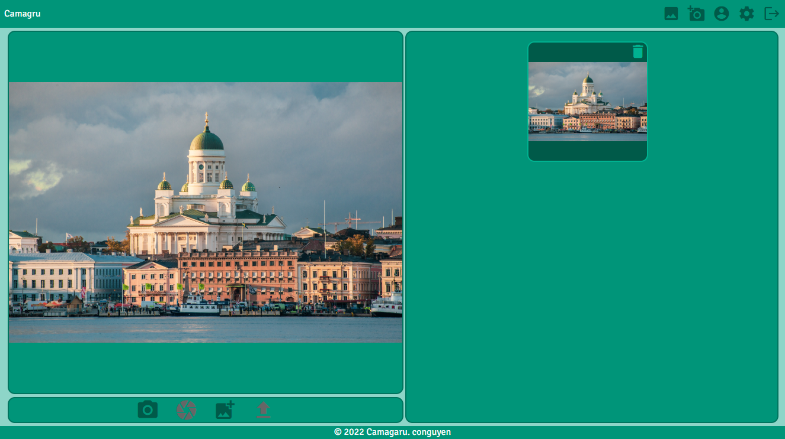
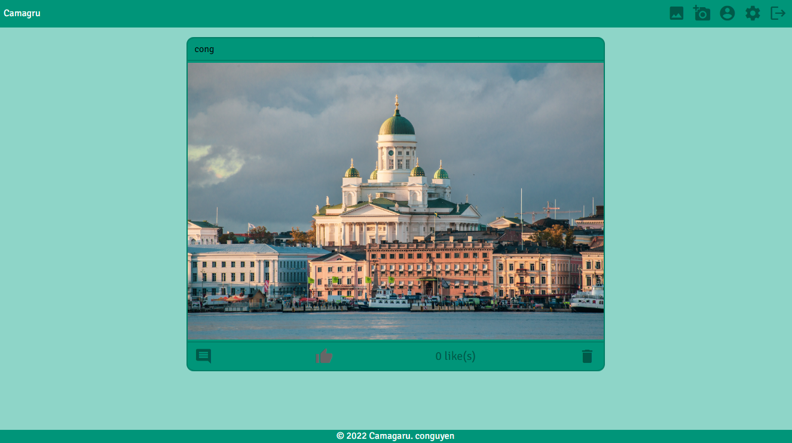
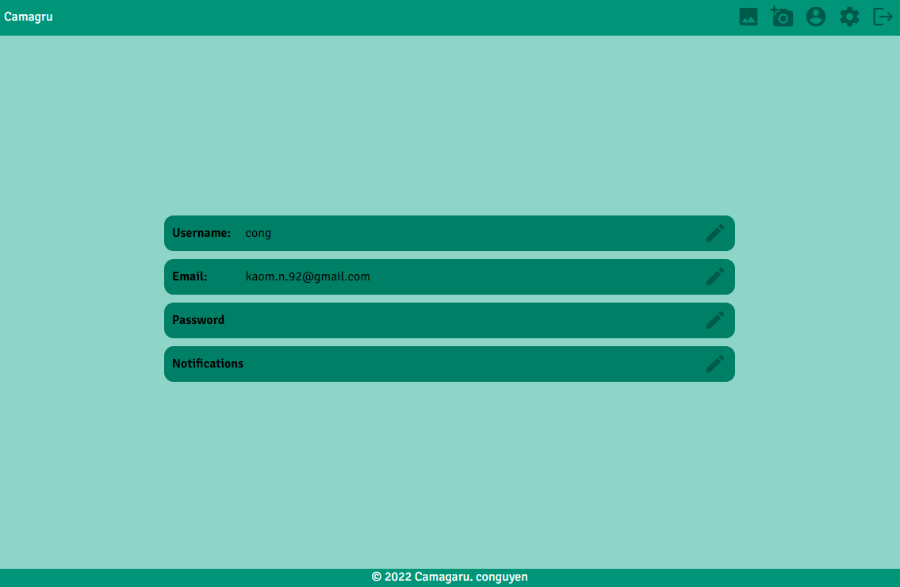

# Camagru

Camagru is the first project of the web branch in Hive Helsinki.  
The object was to create an instagram-like web application that allows to make basic image processinging using webcam and/or predefined images  

## Requirements for the project:  
* Responsive design
* Web app security (no SQL, HTML injections, plain passwords in the databases)
* Authorized languages: [Server] PHP | [Client] HTML - CSS - JavaScript (only with browser native API)
* Authorized frameworks: [Server] None | [Client] CSS Framework tolerated, unless adds forbidden JavaScript
* MySQL/MariaDB with PDO.
* Firefox and Chrome support

## Functionality:  
* User registration/login
* Email sending/validation
* Webcam integration
* Image processing
* Public gallery, commentable and likeable by logged in users.

### Login view

### Upload view

### Gallery view

### User settings view

